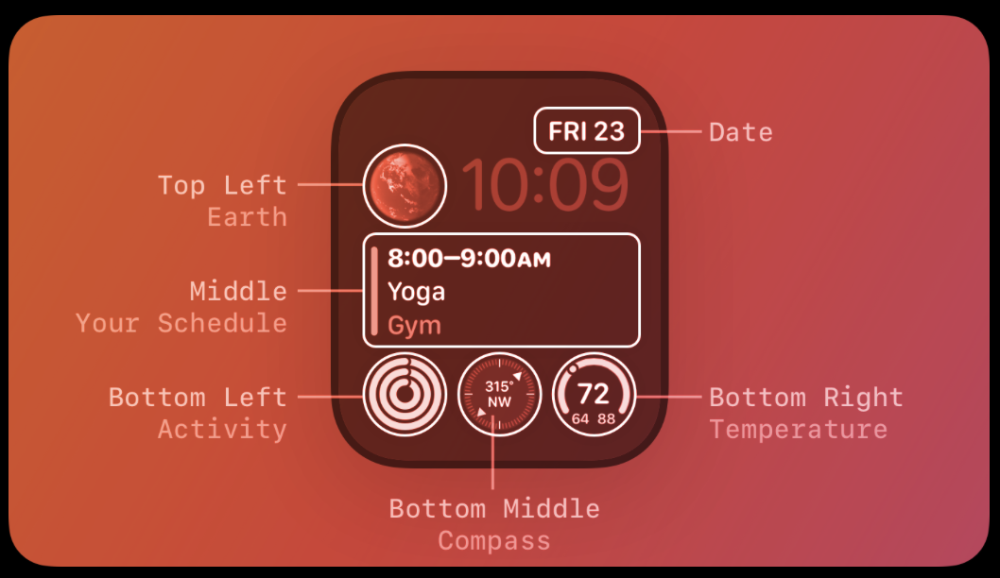

# Watch Calendar Widget

## The Importance of Apple Watch Complications
Some apps solve "irritating" problems: like cool ointment on a mosquito bite, you get a hit of dopamine when you go to familiar places on your iPhone to be productive and entertained. But what if you want to start being productive in places that are not familiar? What if you really meant to stick to that budget, track that calorie, take that pill, but you just *forgot from the amount of the steps needed to access the information* from picking up your device to getting to that final place where the information is stored. This the **friction from steps required**

Apps that solve these problems are known as "prescriptive": they give us access to information we need to be more productive and responsible but at the same time, this information is not something familiar or comfortable to find. I think the iPhone is good at solving problems that actively irritate me. I think Apple Watch Complications are perfect at forcing me to look at prescriptive information and motivate to behave more informed and responsibly. 

Im not going to call that Uber across town when im overbudget for today and I havent burned any calories yet, instead I will walk. If a software engineer is defined as someone who commits code everyday how do I keep attention on that goal? You are successful in video games because indicators tell you the status of your avatar: you know when to feed, grow, excercise, and clean the character based on up to date live indicators attached to the characters. When they need to train more to level up, you know you need to practice more. Why should my real life be any different?

*Apple Watch Complications offer a frictionless way to stay updated with "prescriptive"  information by coupling these data with the need to know the time*

Consequently, I think Apple Watch Complications could be used in much more powerful ways than what I see in the Market currently. I think the Apple Watch Market as a whole is an under-tapped area in need of better development. Apple's own weather complications are faulty, and many apps on the Watch App Store do not advertise their complications. In fact there is no clear way of "wanting a wind-chill complication", a necessary metric for the Canadian winter, and buying it on the App Store. This fact is STRIKING considering how many people have Apple Watches in Canada and how many people would love access to more information as an Apple Watch Complication than ever before. 

For Example:
  "Whats my current balance"
  "How cold does the wind feel right now"
  "What was the last message someone texted me"
  "Do I have any new emails?"
  "What day is my appointment next week"

Conveinently, it happens to be quite easy to program an effective, minimialist, and high value set of complications for the Apple Watch. This method also enforces strong App Development Standards because Apple Watch Complications only use stateless views, default databases, and async networking. Therefore, I've chosen working with Apple Watch Complications as a niche.

## The History of Watch Complications 

### Complications as art

### Complications for information

[HIG - Rectangular Complications](https://developer.apple.com/design/human-interface-guidelines/complications#Rectangular)

[WidgetKit](https://developer.apple.com/documentation/widgetkit)

[Smart Stack](https://developer.apple.com/videos/play/wwdc2023/10029)

